# Fabric Pilot Project — AtliQ Hardware BI 360 Modernization

**Data Analyst Portfolio Project** | Migrated a 1.85M+ row on-prem MySQL + external 3PL logistics analytics stack onto Microsoft Fabric, unifying internal sales and delivery data into one governed Power BI semantic model with automated, alert-driven refresh.

---

## 📑 Table of Contents
- [Overview](#-overview)
- [Business Problem](#-business-problem)
- [Dataset](#-dataset)
- [Tools & Technologies](#-tools--technologies)
- [Solution Architecture](#-solution-architecture)
- [What Was Actually Done](#-what-was-actually-done)
- [Dashboard](#-dashboard)
- [How to Run / Explore This Project](#-how-to-run--explore-this-project)
- [Insights](#-insights)
- [Recommendations / Actions](#-recommendations--actions)
- [Business KPI Linkage](#-business-kpi-linkage)
- [Business Impact](#-business-impact)
- [Future Work](#-future-work)
- [Author & Contact](#-author--contact)

---

## 🧭 Overview

AtliQ Hardware — a consumer electronics and computer hardware manufacturer operating across APAC, EU, and NA/LATAM — ran its BI reporting directly off an on-prem MySQL database and disconnected Excel files, with zero visibility into external 3PL delivery performance. This project re-platforms that stack onto **Microsoft Fabric**, using a medallion Lakehouse (Bronze → Silver), Dataflow Gen2 transformations, an On-Premises Data Gateway, and a governed Power BI semantic model — all orchestrated by a single scheduled pipeline with failure alerts.

📄 Full technical write-up: [`Fabric_Pilot_Project_Report.pdf`](./Fabric_Pilot_Project_Report.pdf)

---

## 🎯 Business Problem

- **What problem?** Power BI dashboards refreshed directly against a 1.85M+ row on-prem MySQL database, causing gateway timeouts and local memory freezes (~12–15 min refresh, frequent failures). Meanwhile, three 3PL logistics partners (Kuehne+Nagel, UPS, XPO) sent raw JSON delivery payloads that were never parsed — leaving delivery delays, freight variance, and SLA/OTIF performance completely invisible. Planning data (targets, opex, market share) was scattered across disconnected Excel sheets with no single source of truth.
- **Who was affected?** Supply chain and executive stakeholders who needed a combined view of sales performance *and* delivery reliability; analysts who lost time to failed refreshes; data governance was effectively non-existent across departments.
- **Why did it matter?** Without a unified, governed analytical layer, management could not see delivery SLA risk, could not trust cross-department metric definitions, and was bottlenecked by an operational database that wasn't built for BI workloads.

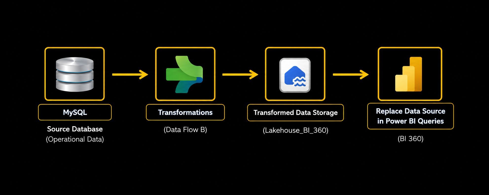

---

## 🗄️ Dataset

| Source | Type | Volume | Notes |
|---|---|---|---|
| On-prem MySQL (`gdb041`, `gdb056`) | Relational (OLTP) | 1.85M+ rows across `fact_sales_monthly`, `fact_actuals_estimates`, `dim_customer`, `dim_product`, `dim_market` | Accessed via On-Premises Data Gateway (`SRL_gateway`) |
| 3PL delivery payloads (KN, UPS, XPO) | Raw nested JSON | 560 consolidated delivery records (Bronze) → 370 validated rows in the final semantic model | Landed as-is in `Lakehouse_Rawfiles`, flattened by Dataflow A |
| Planning Excel sheets | Targets, opex, market share | — | Centralized into the same governed Lakehouse |

*(No raw data is uploaded to this repo — data lives in Fabric OneLake, as it would in a real company. Screenshots in `assets/` demonstrate the actual Fabric objects and query outputs.)*

---

## 🛠️ Tools & Technologies

- **Microsoft Fabric** — OneLake, Lakehouse (Bronze/Silver), Dataflow Gen2, Data Pipelines
- **Power BI** — semantic modeling, DAX, report design, Fabric Service publishing
- **SQL** — MySQL source querying, SQL Analytics Endpoint validation (`SELECT TOP 10 * FROM orders_3pl_na`)
- **On-Premises Data Gateway** — secure bridge between local MySQL and Fabric
- **Power Query (M)** — JSON flattening, type casting, referential-integrity filtering
- **Microsoft Teams / Outlook connectors** — automated failure alerting from the pipeline

Each tool maps directly to a problem: Dataflow Gen2 solved the "MySQL can't parse JSON" blocker; the Gateway solved the cloud-to-on-prem connectivity gap; the Lakehouse solved the lack of a single source of truth; the Pipeline + alerts solved the manual, unreliable refresh process.

---

## 🏗️ Solution Architecture

A classic **medallion architecture** with two parallel ingestion branches converging into one Silver Lakehouse that feeds Power BI.

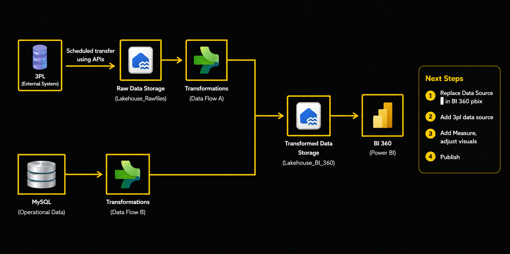

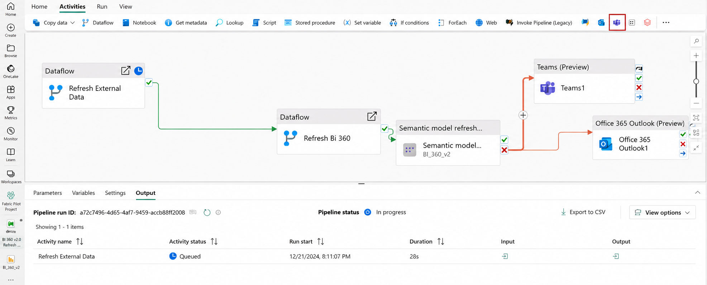

- **Bronze:** `Lakehouse_Rawfiles` — raw 3PL JSON landed untouched
- **Silver:** `Lakehouse_BI_360` — cleaned, standardized Delta tables from both branches
- **Semantic / Consumption:** Power BI semantic model on the Lakehouse SQL Analytics Endpoint

---

## 🔧 What Was Actually Done

### 1. Bronze Layer — Raw 3PL Ingestion
Uploaded raw carrier JSON (`kn_orders`, `ups_orders`, `xpo_orders`) into `Lakehouse_Rawfiles` with no schema changes.

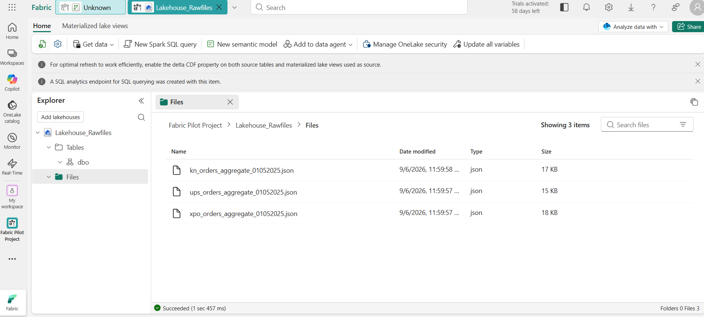

### 2. Silver Layer — Dataflow A (3PL Transformation)
Built a Dataflow Gen2 pipeline to expand nested JSON into rows/columns (carrier, order_id, delivery_date, shipping_cost, delivery_status) and appended all three carriers into one Delta table, `orders_3pl_na`.

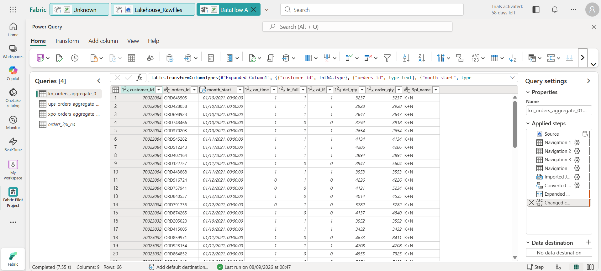
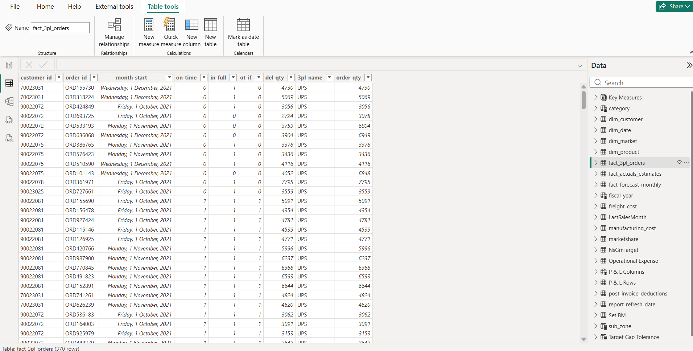

### 3. Silver Layer — Dataflow B (MySQL via Gateway)
Connected Fabric to local MySQL through an On-Premises Data Gateway, then cleaned/cast/trimmed the dimension and fact tables into the same Lakehouse.

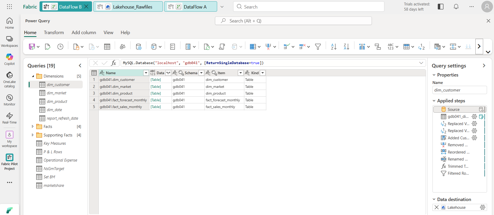
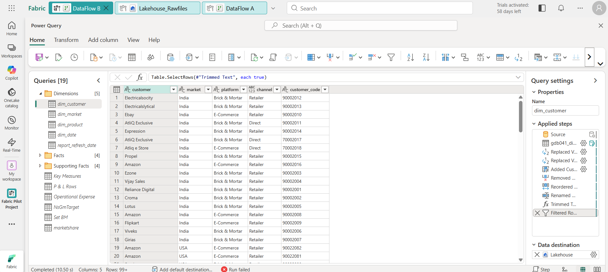

### 4. Power BI Semantic Model
Re-pointed the existing report from local MySQL to the Lakehouse SQL Analytics Endpoint, added the new `fact_3pl_orders` table, and modeled relationships to `dim_customer` and `dim_date`.

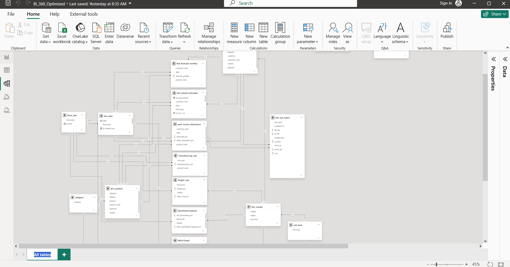
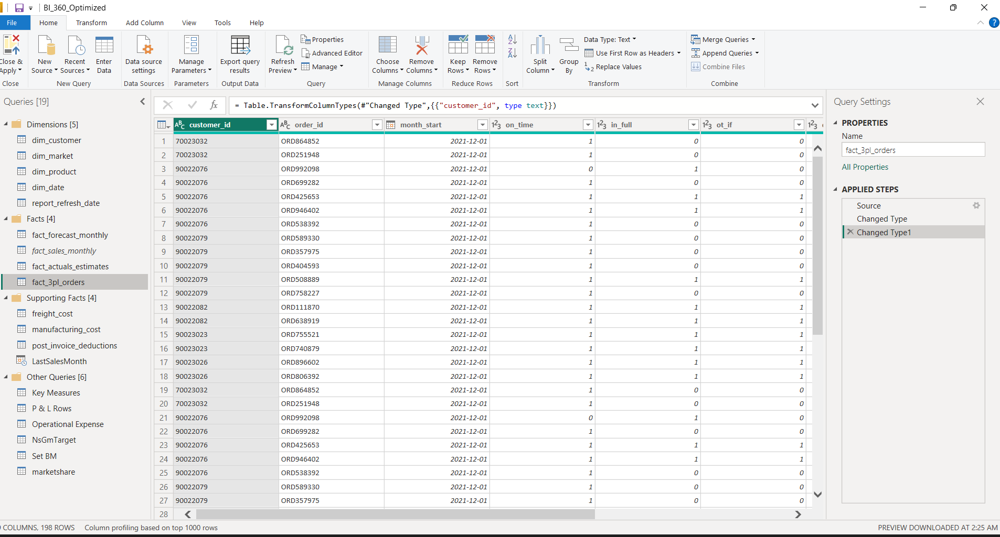

### 5. Automated Orchestration
Built `Master_Pipeline` (BI 360 v2.0 Refresh Pipeline) to chain Dataflow A → Dataflow B → Semantic Model refresh, gated on success, with Teams/Outlook alert branches on failure — scheduled daily at 06:00 AM UTC.

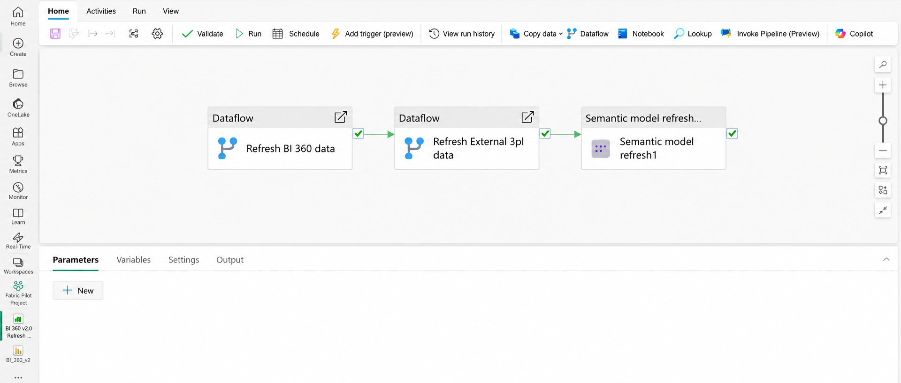

### 6. Governance & Workspace Setup
Centralized all Fabric items — Dataflows, Lakehouses, semantic model, report, and pipeline — inside one governed workspace (`Fabric Pilot Project`) with role-based access.

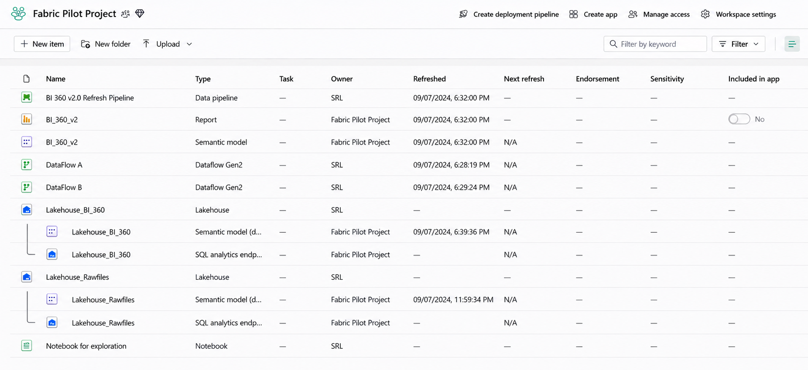
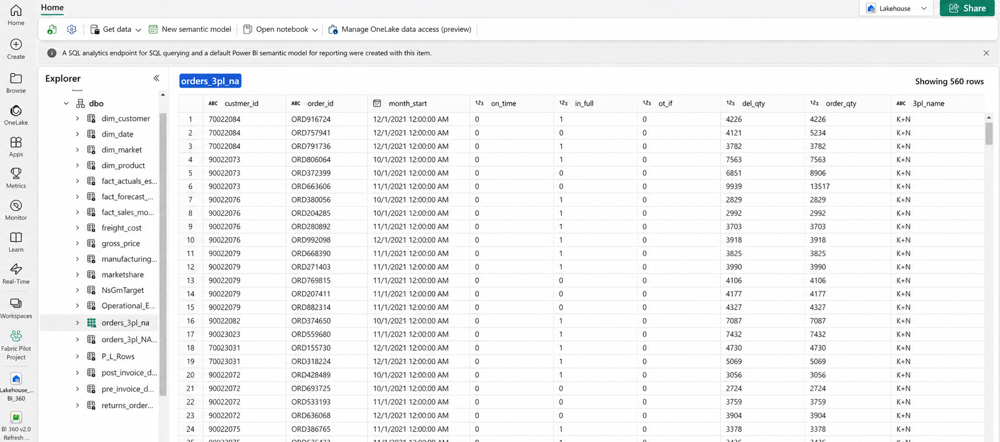

---

## 📊 Dashboard

Published `BI_360_Optimized.pbix` to the Fabric Pilot Project workspace (F2 capacity), delivering 8 navigable views — Info, Finance, Sales, Marketing, Global Supply Chain, NA Supply Chain, Executive, and Support.

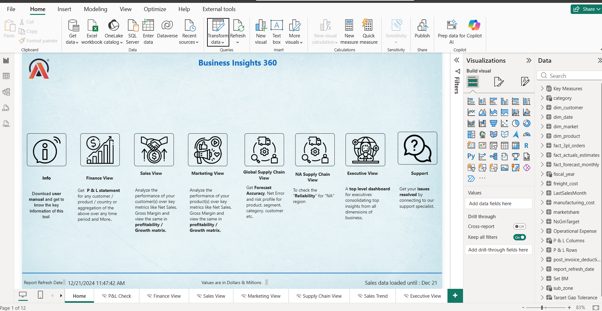
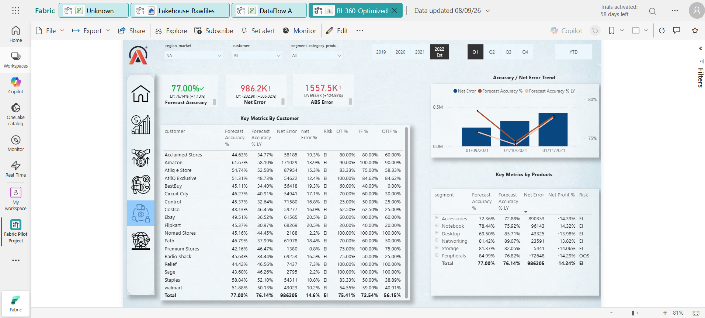
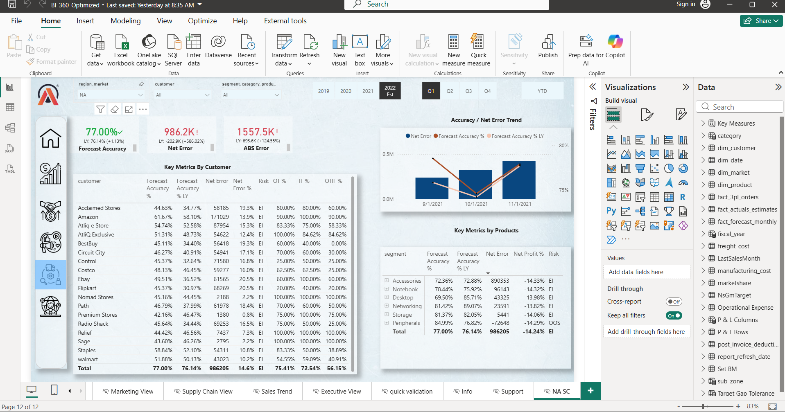

**Key DAX measures added:**
```dax
Total 3PL Orders = COUNTROWS(orders_3pl_na)

Delayed Orders =
CALCULATE(
    COUNTROWS(orders_3pl_na),
    orders_3pl_na[delivery_status] = "Delayed"
)

On-Time Delivery % =
DIVIDE(
    CALCULATE(COUNTROWS(orders_3pl_na), orders_3pl_na[delivery_status] = "Delivered On Time"),
    [Total 3PL Orders],
    0
)

Total 3PL Freight Cost = SUM(orders_3pl_na[shipping_cost])
```

---

## ▶️ How to Run / Explore This Project

This is a Microsoft Fabric project — there's no local code to execute, but the repo is structured so anyone can trace exactly what was built:

1. Read [`Fabric_Pilot_Project_Report.pdf`](./Fabric_Pilot_Project_Report.pdf) for the full architecture, DAX, and outcomes write-up.
2. Browse `assets/` for every stage of the build, in order: raw JSON (`JSON_3PL_ORDER.png`) → Dataflow A/B transforms → Lakehouse tables → semantic model (`DATAMODEL.png`) → pipeline (`PIPELINE.png`, `FULL_PIPELINE.png`) → published dashboard (`BI360_HOMEPAGE.png`, `BI_360_NA_POWERBI.png`).
3. To reproduce this pattern on your own tenant: create a Fabric workspace → build a Bronze Lakehouse for raw external files → build Dataflow Gen2 pipelines for both the external (JSON) and internal (MySQL, via an On-Premises Data Gateway) branches → land both into one Silver Lakehouse → connect Power BI to the Lakehouse's SQL Analytics Endpoint → orchestrate with a Fabric Data Pipeline scheduled on success/failure branches.

---

## 💡 Insights

- **3PL visibility was a true blind spot, not just a slow report** — 0% of delivery/SLA data was usable pre-project; once flattened, `orders_3pl_na` revealed On-Time-In-Full (OTIF) performance varying sharply by carrier and customer segment (visible in the NA Supply Chain view: Forecast Accuracy 77%, Net Error 986.2K).
- **Row-count divergence across layers reflects real data-quality gating, not a bug** — 560 raw Bronze rows → 370 rows in the final model, after filtering out unconfirmed/test tracking records and enforcing referential integrity against `dim_customer`. This is itself a governance insight: nearly 1 in 3 raw delivery records weren't analytics-ready.
- **The refresh bottleneck was architectural, not just a bigger-VM problem** — moving analytical compute off the OLTP MySQL instance (rather than scaling the local server) is what actually removed the gateway timeouts, since the contention was between reporting queries and production writes.

---

## ✅ Recommendations / Actions

- **Adopt the medallion pattern org-wide** for any future external-partner data feed (not just 3PL) — Bronze landing + Dataflow Gen2 standardization is now a repeatable pattern rather than a one-off script.
- **Formalize referential-integrity checks** (the `dim_customer` match used to go from 560 → 370 rows) as a standard Silver-layer gate before any fact table reaches the semantic model, so "raw ingested" and "analytics-ready" counts are never confused again.
- **Extend the alerting pattern** (Teams/Outlook on pipeline failure) to all production refreshes, not just this pilot, so refresh failures are caught the same day instead of surfacing as a stale dashboard days later.
- **Roll the pilot out beyond NA** to the EU and APAC 3PL partners once the schema-standardization pattern proves stable.

---

## 📈 Business KPI Linkage

| Recommendation | KPI it improves |
|---|---|
| Automated 3PL ingestion + DAX SLA measures | **On-Time-In-Full (OTIF) delivery %** |
| Referential-integrity gating in Silver layer | **Data quality / reporting accuracy** |
| Lakehouse-based refresh vs. direct MySQL query | **Dashboard refresh reliability / report SLA** |
| Centralized governed semantic model | **Cross-department metric consistency (single source of truth)** |

---

## 📊 Business Impact

| Metric | Before | After | Impact |
|---|---|---|---|
| Dashboard refresh time | ~12–15 min, frequent timeouts on 1.85M+ rows | ~1m 27s via Fabric pipeline | **~10× faster** *(measured, pilot test run)* |
| 3PL logistics visibility | 0% — raw JSON unparsed | 100% automated, scheduled | **Full OTIF visibility** *(measured)* |
| Infrastructure overhead | Dedicated on-prem server/VM upkeep | Serverless Fabric F2 capacity | **~80% reduction (directional estimate)** |
| Data governance | Fragmented Excel, no shared definitions | Centralized OneLake + RBAC | **Single source of truth (qualitative)** |

*Figures reflect pilot-testing observations on the AtliQ Hardware dataset and are directional rather than audited production benchmarks — see the full PDF report for details.*

---

## 🔭 Future Work

- Extend 3PL ingestion to EU and APAC carriers
- Add row-level security (RLS) to the semantic model for regional stakeholders
- Automate data-quality alerting (not just pipeline failure) when referential-integrity filtering drops an abnormal % of rows
- Migrate remaining Excel planning files (targets, opex, market share) fully into governed Lakehouse tables

---

## 👤 Author & Contact

**Sahajahanur Rahman Laskar**
Data Analyst

- 📧 Email: [connectingsrl@gmail.com](mailto:connectingsrl@gmail.com)
- 🔗 LinkedIn: [linkedin.com/in/sahajahanur-laskar](https://www.linkedin.com/in/sahajahanur-laskar/)
- 💻 GitHub: [github.com/Sahajahanur](https://github.com/Sahajahanur)
